<div align="center">

# Sheaf Browser

**A browser for development teams** — the header switcher, JSON viewer, cookie
editor and request mocker you already install, built in and written from
scratch. Free and open source.

[](https://github.com/rajeshkumaravel/sheaf-browser/actions/workflows/ci.yml)
[](https://github.com/rajeshkumaravel/sheaf-browser/releases)
[](https://github.com/rajeshkumaravel/sheaf-browser/tags)
[](https://github.com/rajeshkumaravel/sheaf-browser/releases)
[](https://github.com/rajeshkumaravel/sheaf-browser/releases/latest)
[](LICENSE)

[](https://www.electronjs.org/)


[](https://nodejs.org/)

[](#download)
[](#privacy--no-network-calls-of-its-own)
[](CONTRIBUTING.md)
[](https://github.com/rajeshkumaravel/sheaf-browser/stargazers)

[Visit Website](https://rajeshk.dev/sheaf-browser?utm_source=github&utm_medium=readme&utm_campaign=sheafbrowser) · [Download](#download) · [Walkthrough](#walkthrough) · [Features](#features) · [The tools](docs/PLUGINS.md) · [Privacy](#privacy--no-network-calls-of-its-own) · [Contributing](#contributing)

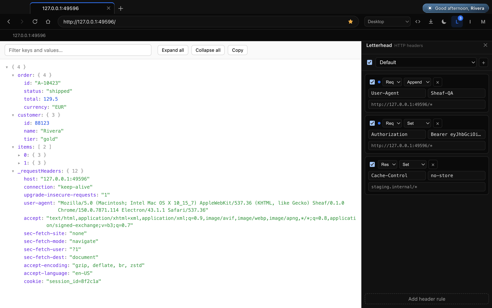

*Letterhead rewriting the request while Folio renders the response — one window, no extensions.*

</div>

---

## Why

Every developer ends up with the same pile: a header switcher, a JSON viewer, a
cookie editor, a request mocker. Four extensions, four permission prompts asking
to *"read and change all your data on all websites"*, and four things to
re-install on a new laptop.

The workarounds are worse. Testing against an internal cert or a CORS-blocked
API usually ends with someone running their **daily browser** with
`--disable-web-security`. That's the browser they also read email in.

**A sheaf binds separate papers into one volume.** The tools are built in, the
browser is one you only use for development, and nothing you configure ever
leaves your machine.

## Download

Grab the latest build from the [**Releases**](../../releases) page:

| Platform | File |
|----------|------|
| macOS (Apple silicon / Intel) | `.dmg` or `.zip` |
| Windows (x64 / arm64) | `.exe` (NSIS installer) or `.zip` |
| Linux (x64 / arm64) | `.AppImage` or `.deb` |

Builds are **unsigned** — see [Installing](#installing) for the one-time step per
OS. On first launch Sheaf asks what to call you, and nothing else.

## Walkthrough

<div align="center">

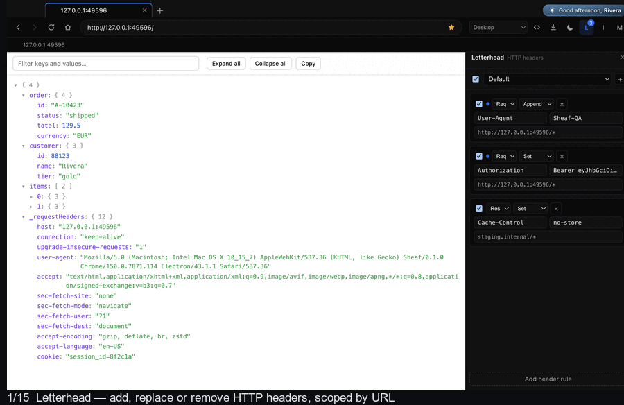

*Fifteen slides, captioned, on a loop.*

Prefer to click through at your own pace?
[`screenshots/index.html`](screenshots/index.html) is a self-contained slider
with a scrubber, arrows and ← → keys — open it locally (`open
screenshots/index.html`) or publish `screenshots/` with GitHub Pages.

</div>

### Dark and light

| Dark | Light |
|:--:|:--:|
| 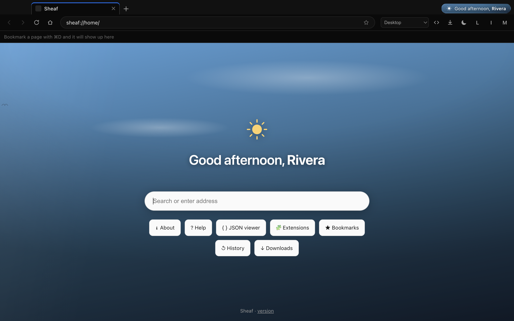 | 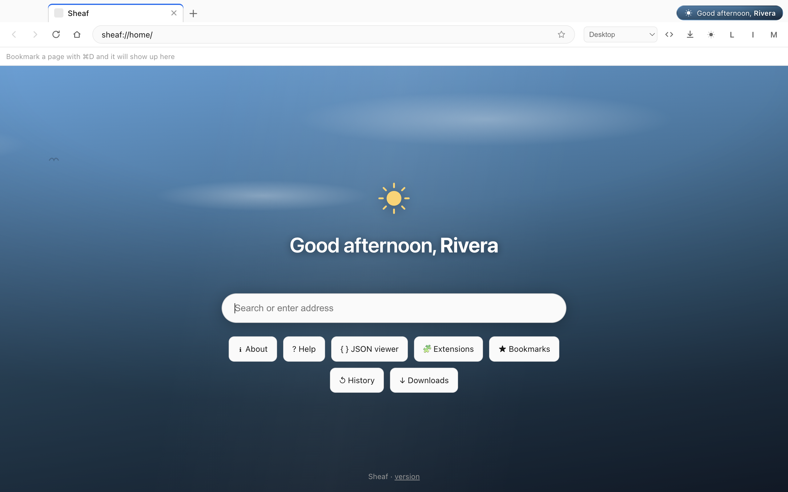 |

<details>
<summary><b>Every screen, one by one</b></summary>

| | |
|:--|:--|
|  | **Letterhead** — add, replace or remove request & response headers, scoped by URL. The blue dots mark the rules applying to this page. |
| 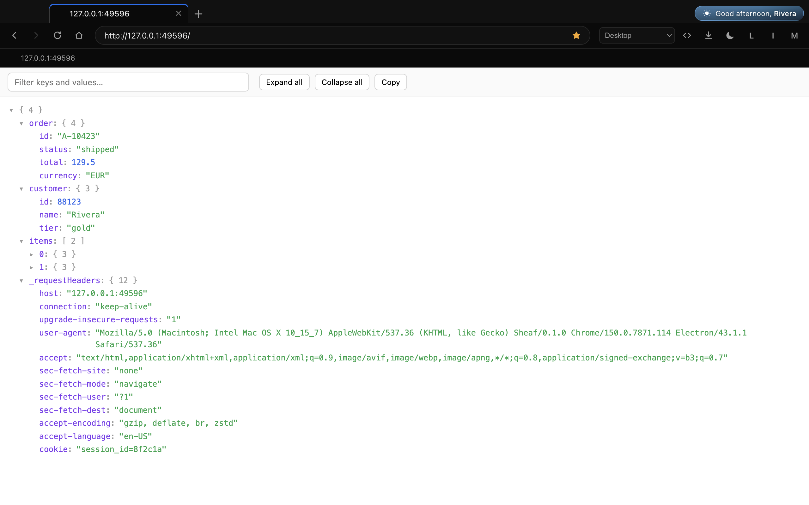 | **Folio** — any JSON becomes a searchable tree; click a key to copy its path. |
| 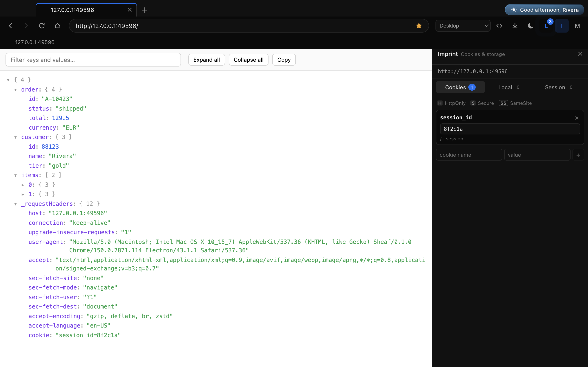 | **Imprint** — cookies, localStorage and sessionStorage for the current origin, editable in place. |
| 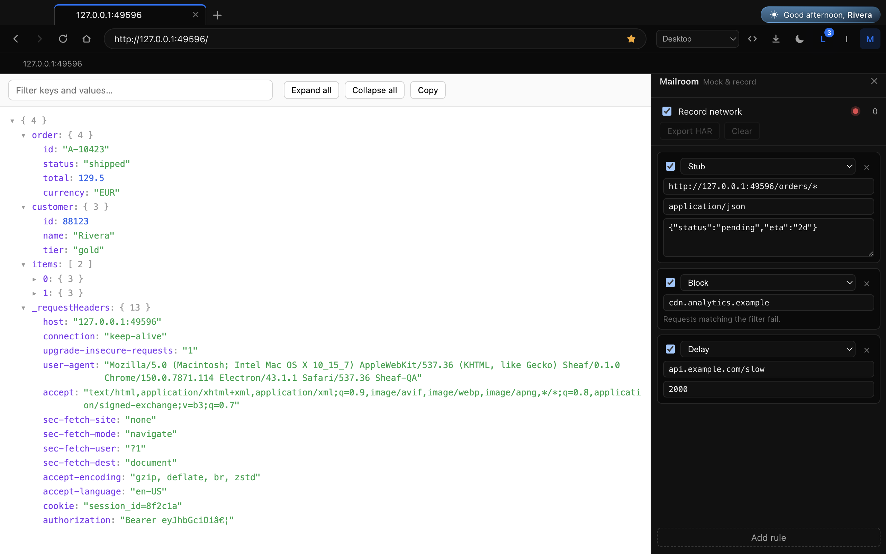 | **Mailroom** — stub, redirect, block or delay requests, and export a HAR. |
| 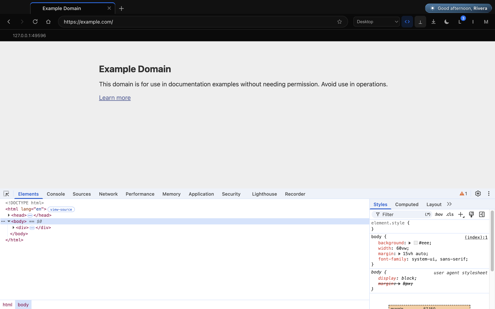 | **DevTools** — the real Chrome panels, docked in the window and resizable. |
| 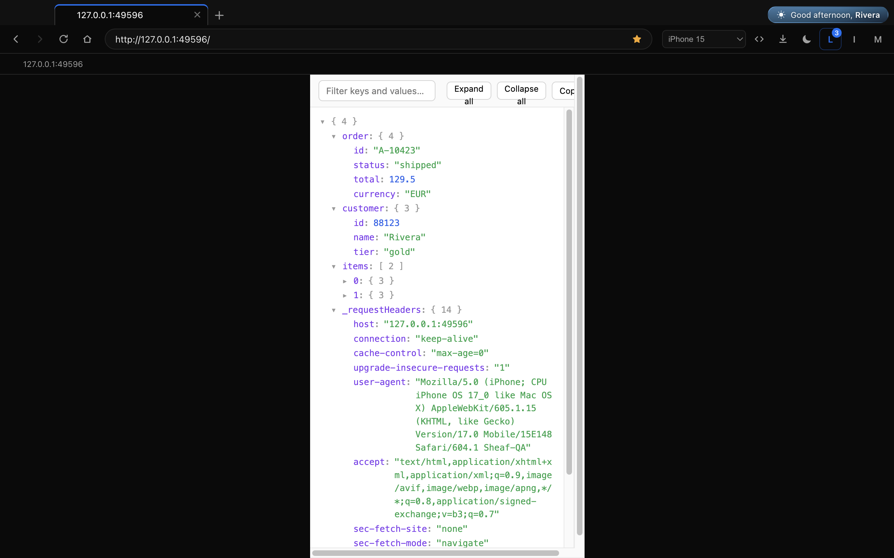 | **Device simulation** — presets resize the viewport and swap the user agent. |
| 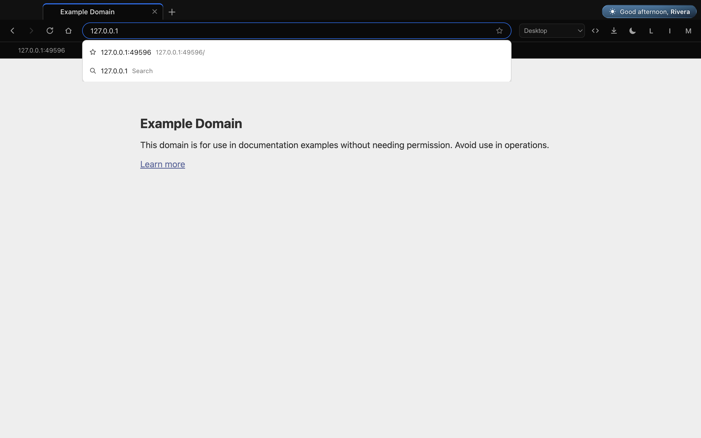 | **Omnibox** — suggestions ranked from your own history and bookmarks. Never a search engine. |
| 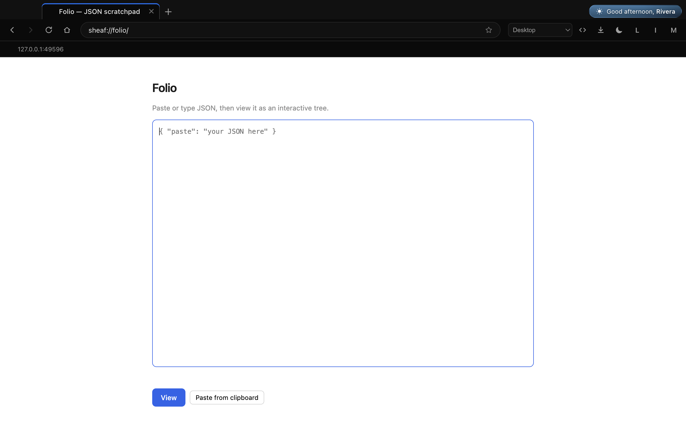 | **Folio scratchpad** — paste JSON from anywhere and read it as a tree. |
| 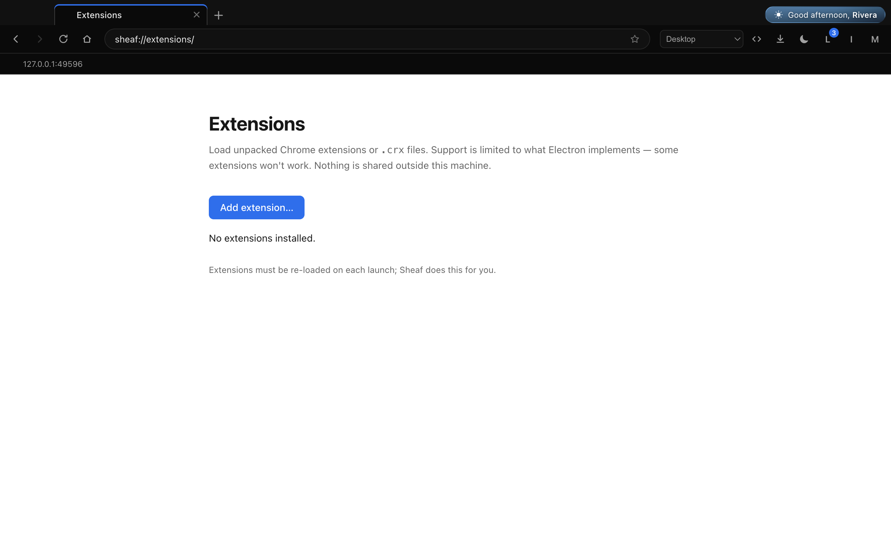 | **Extensions** — load unpacked Chrome extensions or `.crx` files. |
| 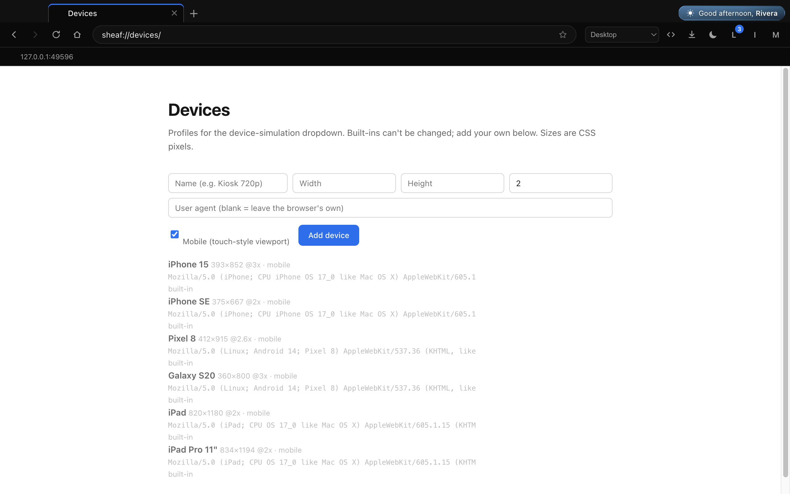 | **Devices** — add your own device profiles. |
| 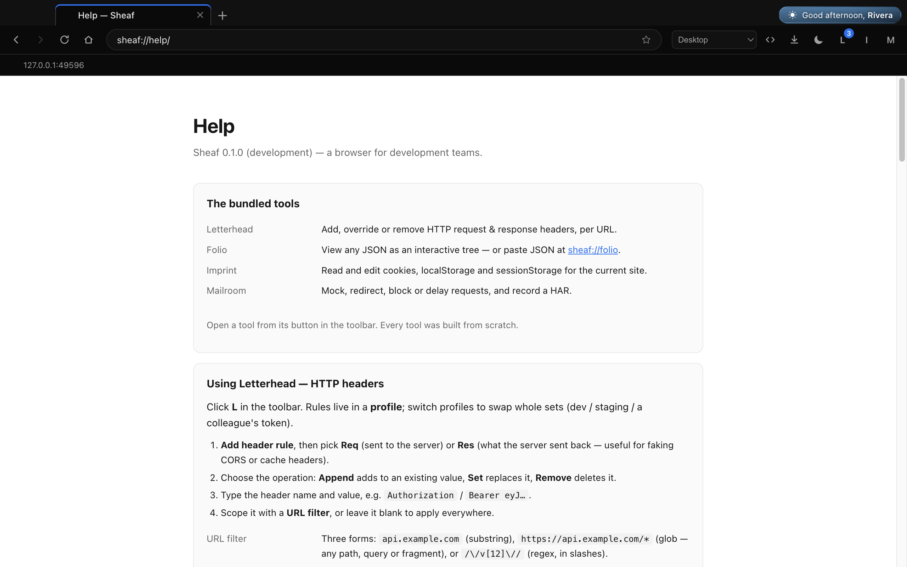 | **Help** — how to use each tool, keyboard shortcuts, and honest security notes. |
| 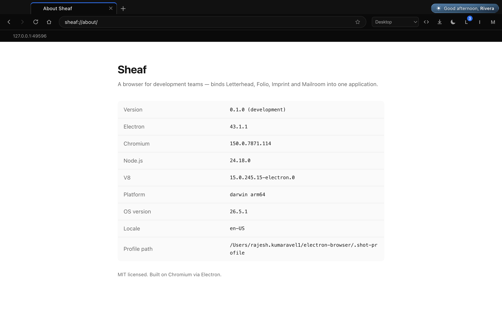 | **About** — versions, platform, and where your data lives. |
| 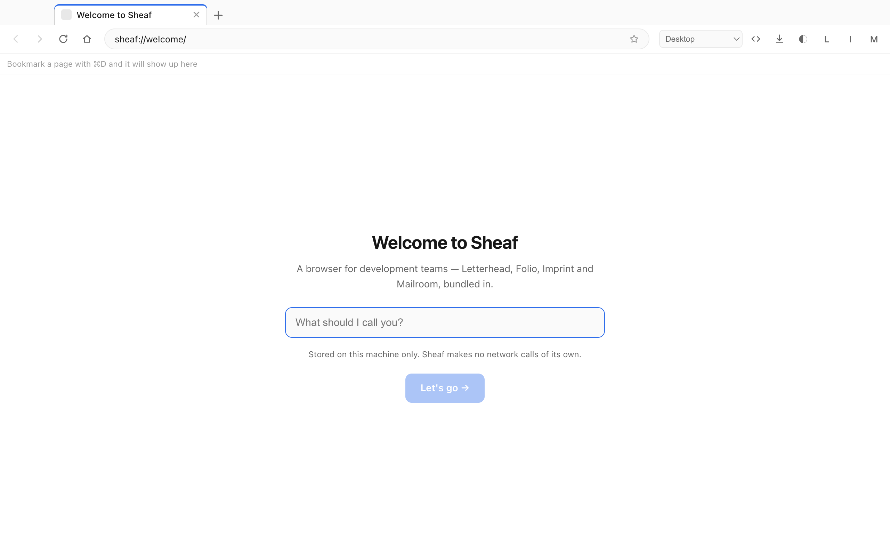 | **First launch** — a name, and nothing else. |

</details>

## Features

### The tools, built in


- **Letterhead** — add, replace or remove **request *and* response** headers,
  scoped by substring, glob or regex. Profiles swap whole rule sets. The icon
  pulses while a rule applies to the page you're on, so a rule that isn't
  matching is obvious.
- **Folio** — every JSON response becomes a searchable, collapsible tree with
  copy-path on any key. It replaces Chromium's built-in viewer, which has none of
  those. `sheaf://folio` is a paste-anything scratchpad.
- **Imprint** — read and edit cookies (including **HttpOnly**), localStorage and
  sessionStorage for the current origin.
- **Mailroom** — stub a response, redirect a URL, block it, or delay it; record
  the session and **export a HAR** to attach to a ticket.

Full documentation: **[docs/PLUGINS.md](docs/PLUGINS.md)**.

> **Why not just use the extensions?** Electron has no
> `chrome.declarativeNetRequest`, so a Manifest V3 header extension *cannot*
> work here — it would install, render, and silently change nothing. Letterhead
> hooks `session.webRequest` in the main process instead, which sees responses
> too and has no rule-count ceiling.

### A real browser

- **Tabs** with drag-free reordering by context menu, duplicate, close-others,
  and middle-click to close.
- **Private windows** — a throwaway in-memory session; no history, downloads or
  cookies kept.
- **Omnibox** that tells addresses from searches, with suggestions ranked from
  your history and bookmarks (bookmarks win — an explicit save beats a visit).
  Typing `javascript:` never executes it.
- **Bookmarks** bar and `⌘D`, **find-in-page** with match counts, **zoom** per
  tab, **downloads** with progress and reveal, page/tab **context menus**, and a
  full native **menu bar**.
- **Dark / light / system** — one toolbar click; open pages re-theme live.

### Built for debugging


- **DevTools docked in the window** — Elements, Console, Sources, Network,
  Application, Performance and the rest. Dock bottom or right, drag to resize.
- **Device simulation** — iPhone / Pixel / iPad presets, or add your own at
  `sheaf://devices`. Resizes the viewport, sets the DPR and swaps the UA — and
  works *at the same time* as DevTools.
- **Chrome extensions** — load unpacked folders or `.crx` files (Sheaf unpacks
  them itself) and they re-load on every launch. Within
  [Electron's limits](https://www.electronjs.org/docs/latest/api/extensions).

## Privacy — no network calls of its own

The only requests Sheaf makes are the ones **you** make by browsing. No account,
no sync, no telemetry, no crash reporting.

- **No weather API, no IP geolocation.** The home page's greeting and sky come
  from your **system clock**. An earlier build ported a live-weather feature from
  a sibling project and it was removed: it called `ipapi.co` (free tier *"not
  meant for use in production"*) and `open-meteo.com` (non-commercial only), and
  it sent every user's IP to a third party to decorate a new tab.
- **No remote assets.** Every icon, scene and animation is generated SVG/CSS in
  [`src/shared/skyArt.ts`](src/shared/skyArt.ts).
- **Bookmark icons are local.** Captured once while you're on the site and stored
  as data URIs — showing the bookmarks bar never pings the sites you bookmarked.
- **Spellcheck is macOS-only.** On Windows/Linux Chromium fetches dictionaries
  from Google's CDN, so Sheaf disables it there.
- **Your rules never leave.** Headers, mocks and cookies are applied and stored
  locally, in a SQLite file on your machine.

Enforced by tests, not just claimed: `npm run verify` records every request the
app makes, **proves the recorder works**, then asserts that sitting on the home
page produces zero outbound requests and that no weather/geolocation/analytics
host is ever contacted. See [SECURITY.md](SECURITY.md).

## Installing

Sheaf ships **unsigned** — the app is fine, the OS just can't verify a
publisher, so it warns once per machine.

**macOS.** A downloaded build may say the app "is damaged" — that's the
quarantine flag, not damage. After dragging Sheaf to Applications:

```bash
xattr -dr com.apple.quarantine /Applications/Sheaf.app
```

**Windows.** SmartScreen shows "Windows protected your PC" → **More info** →
**Run anyway**.

**Linux.** `chmod +x` the AppImage, or install the `.deb`.

> **Auto-update** works on Windows and Linux. It cannot work on macOS for
> unsigned builds — grab new macOS releases from the Releases page.

## Quick start

Install, open, and it greets you. Then:

1. Open any JSON URL — **Folio** renders it as a tree, no setup.
2. Click **L**, add a header rule, and watch the icon pulse on a matching page.
3. Click **M**, tick **Record network**, reproduce a bug, **Export HAR**.

Press `⌘⇧U` for the JSON scratchpad, and see **Help** (`sheaf://help`) for a
guide to every tool.

## Development

Requires **Node.js 24+** (see `.nvmrc`).

```bash
git clone https://github.com/rajeshkumaravel/sheaf-browser && cd sheaf-browser
npm install
npm run dev          # launch with hot reload
npm run typecheck    # tsc for main + preload + renderer
npm run verify       # drive the real app end-to-end (~78 checks)
npm run screenshots  # regenerate the docs screenshots + walkthrough
```

`npm run verify` launches the actual Electron app with Playwright in an isolated
profile and walks the whole feature set — including a real HTTP server to assert
that headers, stubs and HAR capture reach the wire. It exits non-zero on the
first failure.

### Build installers

```bash
npm run build:mac    # -> dist/*.dmg, *.zip
npm run build:win    # -> dist/*.exe, *.zip
npm run build:linux  # -> dist/*.AppImage, *.deb
```

### Where your data lives

| macOS | Windows | Linux |
|---|---|---|
| `~/Library/Application Support/Sheaf/` | `%APPDATA%\Sheaf\` | `~/.config/Sheaf/` |

`sheaf.db` (settings, history, bookmarks, downloads, tool rules) ·
`extensions/` (unpacked, re-loaded each launch). Deleting the folder resets the
app — or use **Help → Reset Sheaf**, which does it and restarts.

## Tech stack

[Electron 43](https://www.electronjs.org/) · [electron-vite](https://electron-vite.org/)
· [React 19](https://react.dev/) · TypeScript (strict)
· [better-sqlite3](https://github.com/WiseLibs/better-sqlite3) (local store)
· [Zustand](https://zustand-demo.pmnd.rs/) · [adm-zip](https://github.com/cthackers/adm-zip) (CRX unpacking)
· [Playwright](https://playwright.dev/) (end-to-end verification)

Every runtime dependency is MIT; the two dev-only ones are Apache-2.0. **No GPL
or AGPL, ever** — it would make an MIT release impossible. See
[CONTRIBUTING.md](CONTRIBUTING.md).

<details>
<summary><b>Project layout</b></summary>

```
plugins/                  the four tools — one directory each
  letterhead/  main/ (webRequest hooks) · renderer/Panel.tsx
  folio/       content/  (runs in the page's isolated world)
  imprint/     main/ · renderer/Panel.tsx
  mailroom/    main/ · renderer/Panel.tsx
src/
  shared/      types.ts, ipc.ts, plugins.ts, devices.ts, skyArt.ts  — typed IPC + shared logic
  main/
    tabs/      manager.ts        — WebContentsView per tab, layout, DevTools, emulation
    windows/   window.ts, overlay.ts, splitter.ts
    plugin-host/                — the webRequest multiplexer
    protocols/ internal.ts      — sheaf:// pages
    extensions/                 — CRX unpack + registry
    store/     sqlite.ts, repositories/
  preload/     chrome.ts (the chrome's typed bridge) · content.ts (page world)
  renderer/    index.html (chrome) · overlay.html · splitter.html
```

The renderer only ever calls `window.sheaf.invoke('channel', …)`, typed
end-to-end by `src/shared/ipc.ts`. Page content is a native `WebContentsView`
composited *over* the chrome — which is why the omnibox dropdown and the DevTools
divider are their own views rather than DOM elements.

</details>

<details>
<summary><b>Screenshots &amp; walkthrough</b></summary>

Everything in [`screenshots/`](screenshots/) is generated by driving the real
app, so the docs can't drift from what it renders:

```bash
npm run screenshots
```

`scripts/screenshots.mjs` captures each screen. Because a tab's content, the
docked DevTools and the omnibox dropdown are each a native view composited over
the chrome, no single capture sees the whole window — the script captures the
chrome plus every visible view and composites them at their real bounds.
`scripts/make-walkthrough.mjs` owns the slide order and captions, and emits the
numbered stills, `walkthrough.gif` and the self-contained `index.html` slider.

Maintainer tool — the GIF needs ImageMagick (`brew install imagemagick`). The
outputs are committed, so contributors never need to run it.

</details>

## Roadmap / non-goals

Sheaf is a **development** browser. It is not trying to be your daily driver, a
privacy browser, or a Chrome replacement.

**Known non-goals:** DRM playback (no Widevine CDM — Netflix and Spotify won't
play), the Chrome Web Store, password management, autofill, and sync.

**Ideas and PRs welcome for:** network throttling and touch emulation (both need
CDP, which currently conflicts with open DevTools), a JWT decoder, per-profile
proxy switching, and shareable workspaces.

## Contributing

Bug reports, feature ideas, docs fixes and code are all welcome. See
[CONTRIBUTING.md](CONTRIBUTING.md) for setup, the checks to run, and the
**clean-room provenance rule** — Sheaf's tools are written from scratch, and
every ModHeader source on GitHub is AGPL/GPL/unlicensed, so reading one while
implementing a plugin would poison the MIT licence.

- [Open an issue](https://github.com/rajeshkumaravel/sheaf-browser/issues/new/choose) for a bug or feature
- Found a security problem? Report it **privately** — see [SECURITY.md](SECURITY.md)

> Every repository link derives from one constant — `SHEAF_REPO` in
> [`src/shared/repo.ts`](src/shared/repo.ts):
> **https://github.com/rajeshkumaravel/sheaf-browser**. The README, CONTRIBUTING,
> the in-app Help page and `electron-builder`'s publish target all follow it.

## License

[MIT](LICENSE) — free to use, modify and distribute.
